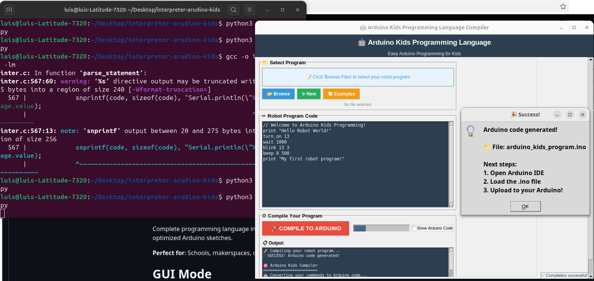

# 🤖 Arduino Kids Programming Language Interpreter

[](https://en.wikipedia.org/wiki/C_(programming_language))
[](https://www.arduino.cc/)
[](LICENSE)
[](README.md)
[](arduino_gui.py)

> **A complete educational IDE with GUI that translates kid-friendly commands into production Arduino C++ code**



## 🌟 Overview

Complete programming language interpreter with professional GUI for kids aged 8-16. Converts simple English commands into optimized Arduino sketches.

**Perfect for**: Schools, makerspaces, coding camps, and STEM education.

## ⚡ Quick Start

### GUI Mode (Recommended)
```bash
gcc -o inter inter.c -lm
python3 arduino_gui.py
# Click "Examples" → Choose program → "COMPILE TO ARDUINO"
```
### Command Line
```bash
gcc -o inter inter.c -lm
echo 'print "Hello!"
turn_on 13
blink 13 5' > test.txt
./inter test.txt

```

# 🚀 Features
## GUI Interface

- Drag & Drop: Easy file loading
- Code Editor: Built-in with syntax highlighting
- Examples: Pre-loaded robot programs
- One-Click Compile: Big compile button
- Real-time Feedback: Progress and error display

# 📖 Usage
## GUI Mode

Run: ```bash python3 arduino_gui.py ```
Load program (Examples/Browse/New) ```
Edit code in built-in editor
Click "🚀 COMPILE TO ARDUINO"  
Upload .ino file to Arduino IDE
## Command Lne 
```bash
./inter program.txt          # Kid mode
./inter --dev program.txt    # Show Arduino code
./inter --showcase           # Run examples
./inter --help               # Commands
```
📋 Commands
CommandDescriptionExampleturn_on <pin>Turn on LEDturn_on 13turn_off <pin>Turn off LEDturn_off 13blink <pin> <times>Blink LEDblink 13 5beep <pin> <duration>Make soundbeep 8 500move_servo <pin> <angle>Move servomove_servo 9 90print "text"Serial outputprint "Hello!"wait <ms>Delaywait 1000repeat <n> { }Looprepeat 3 { blink 13 1 }
